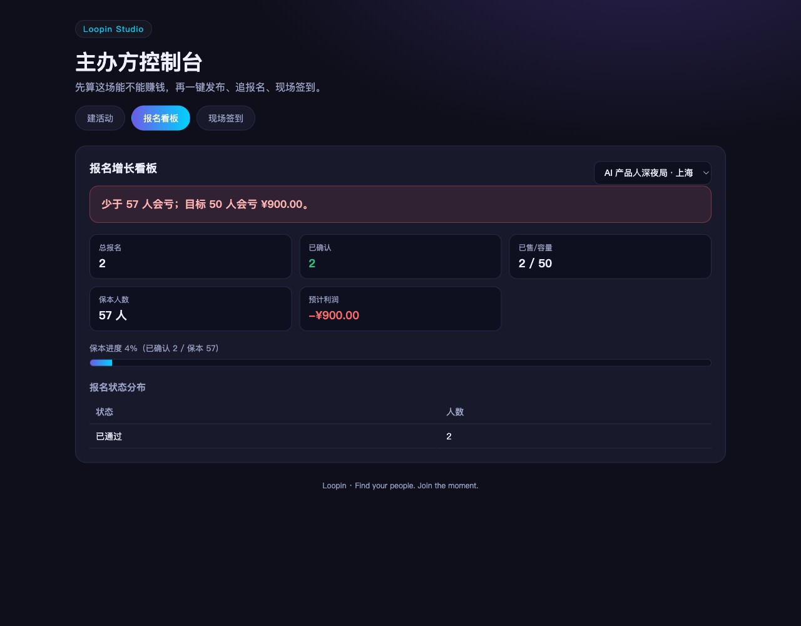

# Loopin

Loopin is an event operating system with two surfaces: a consumer experience for discovering and joining activities, and Loopin Studio for organizers who create, price, promote, and run them.

## Product scope

- Event discovery, detail pages, registration, tickets, waitlists, and check-in.
- Organizer workflows for event creation, quotas, approvals, exports, team permissions, and reminders.
- Topic signals and attribution so organizers can connect promotion activity with registration outcomes.
- A deterministic domain core for pricing, quota allocation, registration state, and form validation.
- A React organizer studio, a Fastify API, and a native WeChat mini program.

## Architecture

~~~text
WeChat mini program (consumer)
             |
             v
Fastify API + auth + registration workflows
             |
     +-------+---------+
     |                 |
SQLite for local dev   Supabase/Postgres for production
     |
Loopin Studio (React) + packages/core (framework-free domain logic)
~~~

Repository layout:

~~~text
packages/core       deterministic domain rules and validation
apps/api            Fastify API and Prisma data access
apps/studio         React organizer console
apps/miniprogram    WeChat mini program
docs                product, deployment, and operational documentation
scripts              checks, readiness gates, and deployment helpers
~~~

## Quick start

Prerequisites: Node.js 20+ and pnpm 10.

~~~bash
pnpm install
pnpm --filter @loopin/core test
pnpm --filter @loopin/api test
pnpm dev:api
pnpm dev:studio
~~~

The API runs on http://localhost:8787 and the studio runs on http://localhost:5273. Import apps/miniprogram into WeChat Developer Tools for the consumer flow. Copy .env.local.example to .env.local and keep all credentials local.

## Testing and operational checks

~~~bash
pnpm test
pnpm build
pnpm db:migration-check
pnpm security:supabase
pnpm production:readiness
~~~

Production checks that touch payment, WeChat devices, or deployment credentials are opt-in and should run with documented test accounts.

## Documentation

- Product and implementation docs: docs/
- Deployment configuration: s.yaml
- Environment template: .env.local.example
- Operations and production gates: README.md#testing-and-operational-checks

## Releases

Create a semantic version tag such as v0.1.0. The release workflow publishes GitHub release notes from that tag. Deployment remains a separate credentialed step.

## Roadmap

- Ship a stable organizer onboarding and event publishing flow.
- Improve consumer discovery, reminders, and attribution analytics.
- Keep payment and permission checks auditable across local and production environments.
- Document the WeChat mini program release checklist for new contributors.

## License

This repository currently does not declare an open-source license. Please contact the owner before redistributing or using it in another product.
